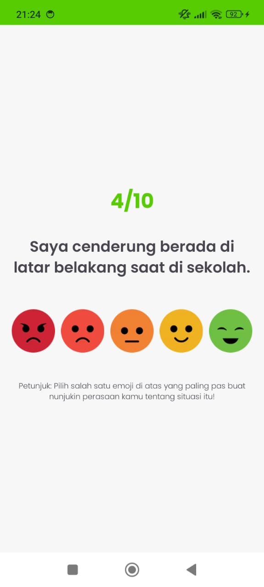
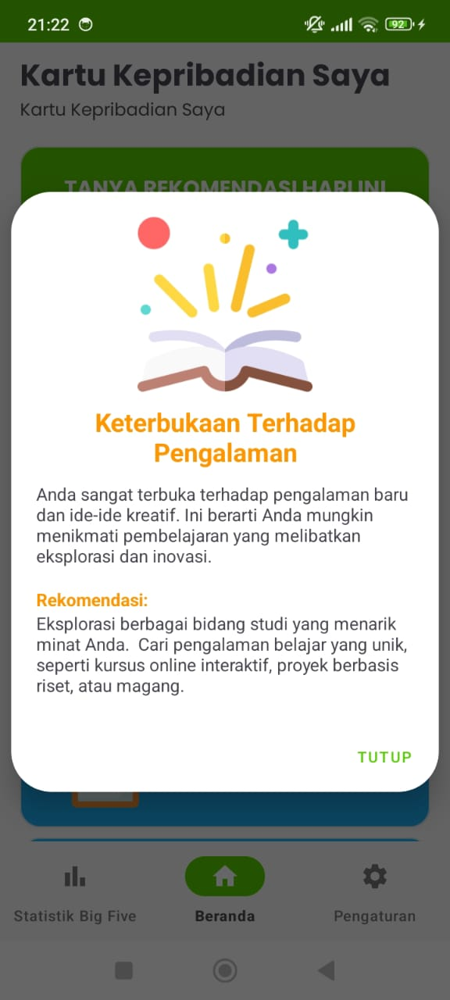
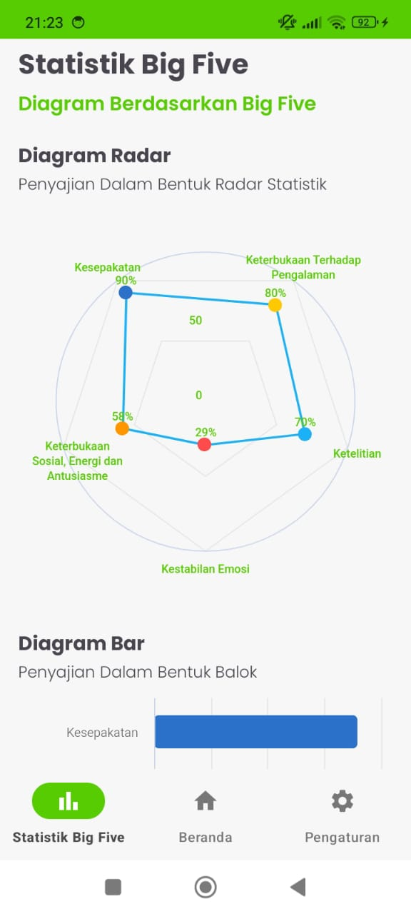
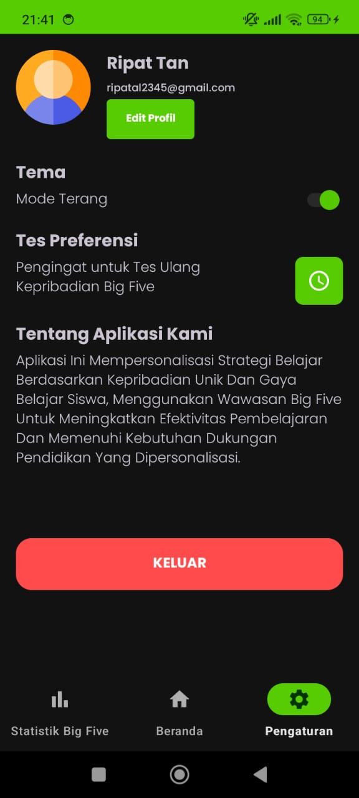

# StudyPath 🎓✨
**Personalized Learning Recommendations Based on Big Five Personality Traits**

## 🌟 Overview
**StudyPath** is an innovative Android application that helps users, particularly those in junior high and senior high schools, who feel bored, lack direction in their learning methods, or have lost their motivation to study. By providing insights into their personality traits using the **Big Five Personality Test** and recommending personalized learning methods based on their personalities, StudyPath aims to reignite their enthusiasm for learning and improve their academic outcomes.

<br>

## 📱 Features  

| Feature                        | Description                                                | Preview                                     |
|--------------------------------|------------------------------------------------------------|---------------------------------------------|
| 🌟 **Big Five Personality Quiz** | 50 engaging questions to assess personality traits.        |  |
| 📊 **Personality Insights**     | Visual representation of test results.                    |  |
| 🧠 **Personalized Recommendations** | Study methods tailored to your personality.              |  |
| 📈 **Statistics Dashboard**     | Displaying personalities by charts.                       |  |
| 🌙 **Dark Mode**                | Comfortable viewing at any time.                          |  |

<br>

## 🚀 Tech Stack
- **Language**: Kotlin
- **Machine Learning**: TensorFlow from Cloud Computing (for personality-based recommendation models).
- **UI/UX**: Material Design.
- **Tools**: Gradle, GitHub Actions (CI/CD).
- **Dependencies**: retrofit, viewpager2, security-crypto, firebase, aachartcore, converter-gson, logging-interceptor, glide, coroutines, datastore.

<br>

## 📳 Demo Application
https://www.youtube.com/shorts/5Skt91hjKjQ

<br>

## 🔧 Installation
1. Clone the repository:
   ```bash
   git clone https://github.com/C242-PS142/StudyPath-Android.git
   cd studypath
